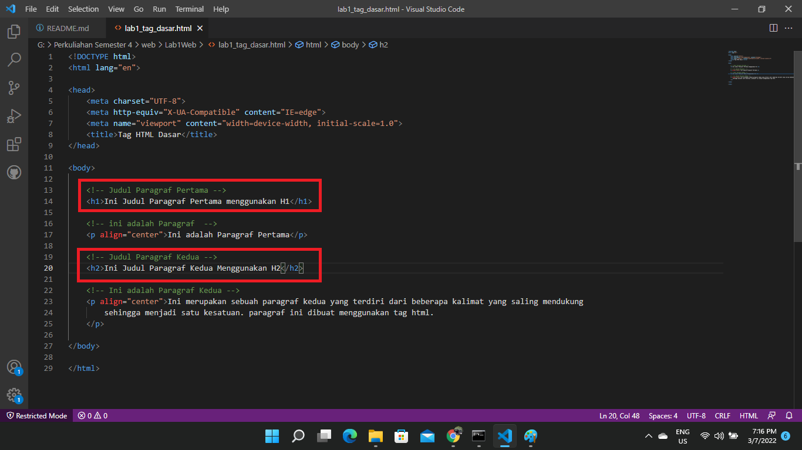
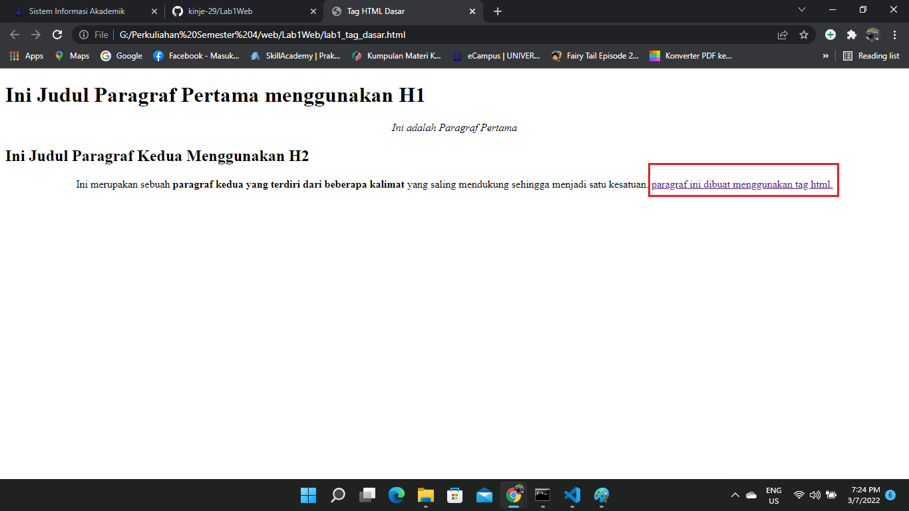

# Lab1Web
## Membuat Halaman Web Dasar HTML
1. Memasukan Title pada bagian HTML

* Maka Tampilan Title dalam web akan berubah seperti gambar di bawah ini

2. Membuat Paragraf `
`
    untuk membuat paragraf harus berada di dalam `<body> </body>`, lalu memasukan `
` dan jangan lupa untuk menutup nya dengan `
` seperti gambar di bawah ini

* Maka akan tampil seperti gambar di bawah ini

3. Membuat Paragraf 2 `
`
    Sama halnya dengan contoh di atas kita hanya membuat sebuah paragraf baru dengan menuliskan `
`

* Maka tapilan paragraf 1 dan Paragraf 2 akan memiliki jeda seperti di gambar bawah ini

4. Membuat Posisi Text berada di tengah
untuk membuat text berada di posisi tengah kita memasukan `align="center"` untuk memasukannya kita tinggal menentukan bagian text mana yang akan berada di posisi tengah.
contoh `
 Ini adalah Paragraf Pertama 
`

* Maka Text Akan ber pindah ke posisi tengah seperti di bawah ini

5. Memasukan Judul
Untuk membuat judul di dalam HTML kita hanya perlu menulis :

`<h1> ->` <h1>Ini adalah H1</h1>
`<h2>->` <h2>Ini adalah H2</h2>
`<h3>-> `<h3>Ini adalah H3 </h3>
`<h4>-> `<h4>Ini adalah H4 </h4>
`<h5>-> `<h5>Ini adalah H5 </h5>
`<h6>-> `<h6>Ini adalah H6 </h6>

* Disini untuk judul paragraf 1 menggunakan `<h1>` dan untuk paragraf 2 menggunakan `<h2>` 

6. Membuat text menjadi Bold
membuat text menjadi bold hanya perlu memasukan `<b></b>` didalam sebuah text contoh seperti di bawah ini

* makan Text akan menjadi Bold seperti tampilan di bawah ini

7. Membuat Tulisan Miring
Untuk membuat tulisan menjadi miring sama halnya seprti diatas kita hanya memasukan `<i></i>` didalam Text.

* Hasilnya seperti di bawah ini

8. Membuat Heperling
Contoh membuat Herpeling :
`<a href="">paragraf ini dibuat menggunakan tag html.</a>`

* Maka akan seperti di bawah ini

9. Menambahkan Gambar
Contoh memasukan Gambar di dalam HTML, untuk memasukan gambar dalam HTML hanya perlu menuliskan `` Contoh seperti dibawah ini.

*  Maka akan Seperti di bawah ini

10. Mengatur ukuran gambar
Untuk mengatur ukuran gambar hanya perlu memasukan `width="ukuran yang di inginkan"` contoh seperti dibawah ini

* Maka akan terlitah ukuranya berbeda dengan sebelumnya

11. Nav Bar
Untuk membuat sebuah Nav Bar hanya perlu memasukan :
    `<nav>`
            `<a href="lab1_tag_dasar.html">Dasar HTML</a>`
            `<a href="lab1_halaman2.html">Halaman 2</a>`
            `<a href="http://www.google.com">Halaman Web Eksternal Google</a>`
    `</nav>`
        `
` 
    Kegunaan `
` untuk membuat garis 

* Maka Akan tampil seperti di bawah ini

# Jawab Pertanyaan Berikut
1. Lakukan perubahan pada kode sesuai dengan keinginan anda, amati perubahannya adakah error ketika terjadi kesalahan penulisan tag?
2. Apa perbedaan dari tag 
 dengan tag  , berikan penjelasannya!
3. Apa perbedaan atribut title dan alt pada tag , berikan penjelasannya!
4. Untuk mengatur ukuran gambar, digunakan atribut width dan height. Agar tampilan gambar proporsional sebaiknya kedua atribut tersebut diisi semua atau tidak? Berikan penjelasannya!
5. Pada link tambahkan atribut target dengan nilai atribut bervariasi ( _blank, _self, _top, _parent ), apa yang terjadi pada masing-masing nilai antribut tersebut?

## Jawab
1. Tidak ada yang error.
2. tag `
` untuk menulis sebuah paragraf pada HTML sedangkan tag ` ` untuk memberikan baris baru pada sebuah HTML.
3. * `ALT` atau text atlternatif adalah atribut yang ditambahkan ke tag gambar dalam HTML. texs ini muncul di dalam wadah gambar ketika gambar tidak dapat di tampilkan. ini membantu mesin pencarian memahami apa isi dari gambar tersebut. text alternatif juga sangat membantu dalam kasus gambar yang tidak ditemukan pada halaman gambar rusak, seperti gambar di bawah ini.

* `Title image` adalah atribut lain yang dapat di tambhakan ke tag gambar dalam HTML. Title image ini digunakan untuk memberikan judul pada gambar. Text yang ada di dalam tag judul tidak akan ditampilkan kepada pengguna ketika gambar tidak dapat di tampilkan. Sebaliknya, tag judul gambar ini ditampilkan saat mouse menyorot pada gambar. seperti gambar di bawah ini.
