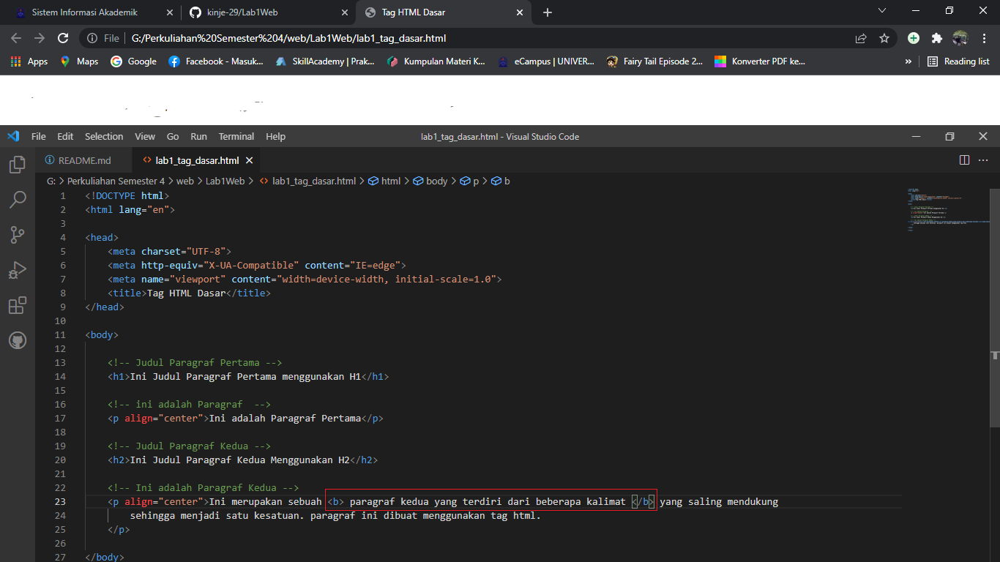

# Lab1Web
## Membuat Halaman Web Dasar HTML
1. Memasukan Title pada bagian HTML

* Maka Tampilan Title dalam web akan berubah seperti gambar di bawah ini

2. Membuat Paragraf `
`
    untuk membuat paragraf harus berada di dalam `<body> </body>`, lalu memasukan `
` dan jangan lupa untuk menutup nya dengan `
` seperti gambar di bawah ini

* Maka akan tampil seperti gambar di bawah ini

3. Membuat Paragraf 2 `
`
    Sama halnya dengan contoh di atas kita hanya membuat sebuah paragraf baru dengan menuliskan `
`

* Maka tapilan paragraf 1 dan Paragraf 2 akan memiliki jeda seperti di gambar bawah ini

4. Membuat Posisi Text berada di tengah
untuk membuat text berada di posisi tengah kita memasukan `align="center"` untuk memasukannya kita tinggal menentukan bagian text mana yang akan berada di posisi tengah.
contoh `
 Ini adalah Paragraf Pertama 
`

* Maka Text Akan ber pindah ke posisi tengah seperti di bawah ini

5. Memasukan Judul
Untuk membuat judul di dalam HTML kita hanya perlu menulis :
        <h1>Ini adalah H1</h1>
        <h2>Ini adalah H2</h2>
        <h3>Ini adalah H3 </h3>
        <h4>Ini adalah H4 </h4>
        <h5>Ini adalah H5 </h5>
        <h6>Ini adalah H6 </h6>

* Disini untuk judul paragraf 1 menggunakan `<h1>` dan untuk paragraf 2 menggunakan `<h2>` 

6. Membuat text menjadi Bold
membuat text menjadi bold hanya perlu memasukan `<b></b>` didalam sebuah text contoh seperti di bawah ini

* makan Text akan menjadi Bold seperti tampilan di bawah ini

7. Membuat Tulisan Miring
Untuk membuat tulisan menjadi miring sama halnya seprti diatas kita hanya memasukan `<i></i>` didalam Text.

* Hasilnya seperti di bawah ini

8. 

* 

9. 

* 

10. 

* 

11. 

* 
